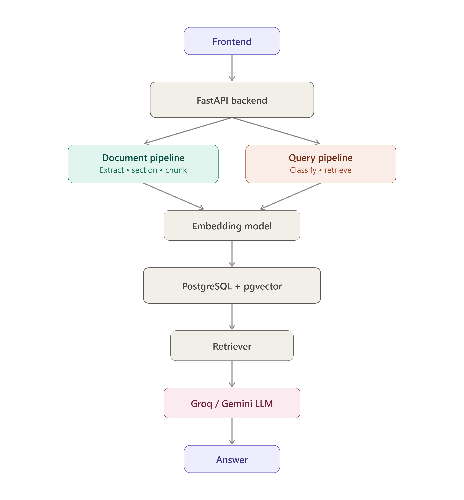

# TinyRetriever


> A Retrieval-Augmented Generation (RAG) workspace for semantic search, conversational question answering, and literature review over research papers.

---

## Overview

TinyRetriever is a Retrieval-Augmented Generation (RAG) workspace for exploring research papers through semantic search, conversational question answering, and AI-assisted literature review.

Instead of manually searching through lengthy documents, users can upload research papers, perform semantic search, ask context-aware questions, generate literature reviews, and manage conversations through a single workspace.

The project focuses on improving retrieval quality using section-aware retrieval, metadata filtering, and vector search powered by PostgreSQL and pgvector.

---

## Why TinyRetriever?

Many RAG systems treat documents as flat text, often overlooking the structure present in research papers.

TinyRetriever addresses this by combining:

- Section-aware retrieval
- Metadata filtering
- Semantic vector search
- Context-aware question answering

This leads to more relevant retrieval and better grounded responses.
---

## Features

- 📄 Upload and manage research papers
- 💬 Conversational question answering
- 📝 Literature review generation
- 🔍 Semantic search
- 📂 Persistent chat sessions
- 📑 Section-aware retrieval
- 🏷️ Automatic metadata extraction
- 🧩 Semantic chunking
- 🗄️ PostgreSQL + pgvector
- ⚡ FastAPI backend
---

## System Architecture
<p align="center">
  
</p>

TinyRetriever follows a modular Retrieval-Augmented Generation pipeline.

1. Users upload research papers through the React frontend.
2. The backend extracts text from PDFs.
3. Documents are divided into logical sections.
4. Metadata and semantic chunks are generated.
5. Chunks are converted into embeddings and stored in PostgreSQL with pgvector.
6. User questions are classified to identify the most relevant document sections.
7. The retriever performs semantic similarity search.
8. Retrieved context is provided to the LLM to generate grounded responses.

---

## Evaluation

To evaluate retrieval performance, I created a benchmark consisting of **35 manually prepared evaluation questions**.

The evaluation focused on:

- Retrieval Quality
- Response Quality
- Retrieval Latency

This benchmark guided architectural decisions including the adoption of section-aware retrieval and the removal of hybrid BM25 search, which empirically reduced answer quality.

---

## Tech Stack

| Category | Technologies |
|----------|--------------|
| Frontend | React, TypeScript |
| Backend | FastAPI, Python |
| Database | PostgreSQL, pgvector |
| AI | Sentence Transformers, Gemini, Groq |
| ORM | SQLAlchemy |
| APIs | Crossref API |

---

## Project Structure

```text
TinyRetriever
│
├── backend/
│   ├── api/
│   ├── retrieval/
│   ├── evaluation/
│   └── database/
│
├── frontend/
│
├── docs/
│   └── architecture.png
│
└── README.md
```

---

## Getting Started

### Clone the repository

```bash
git clone https://github.com/Hrudyasreech/TinyRetriever.git
cd TinyRetriever
```

### Backend

```bash
cd backend

pip install -r requirements.txt

uvicorn main:app --reload
```

### Frontend

```bash
cd frontend

npm install

npm run dev
```

---

## Future Improvements

- Citation highlighting
- Multi-document reasoning
- User authentication
- Streaming responses
- Cloud deployment
- Automatic evaluation dashboard

---
## Key Design Decisions

- **Section-aware retrieval** to narrow the search space before semantic retrieval.
- **Metadata filtering** to improve retrieval relevance.
- **PostgreSQL + pgvector** for scalable vector similarity search.
- **FastAPI** to orchestrate document processing and query workflows.
- **35-question benchmark** to evaluate retrieval quality, response quality, and latency.
---

## Author

**Hrudyasree Ch**

Computer and Communication Engineering Student

Interested in Backend Development, AI Applications, and Retrieval-Augmented Generation systems.
